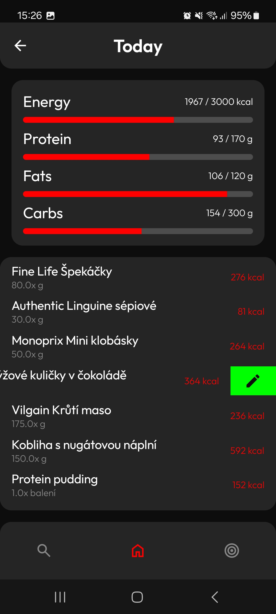
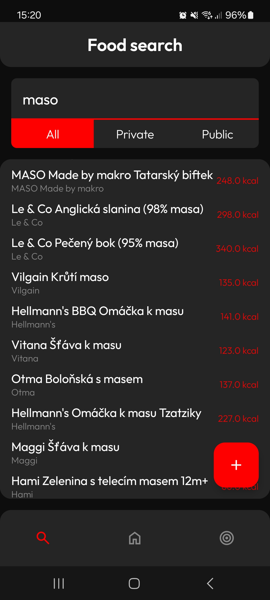
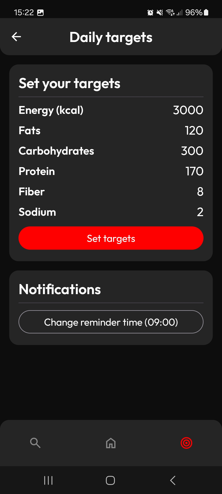
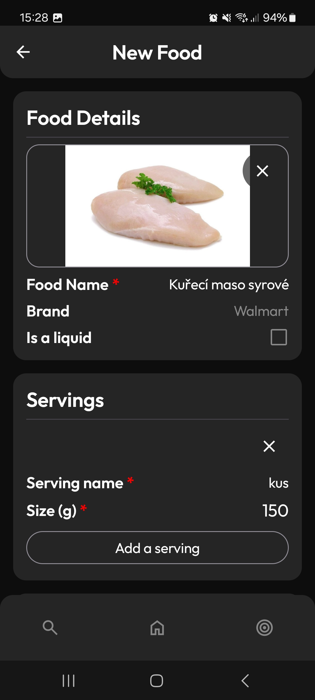
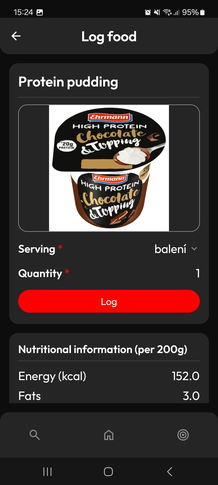

# SOMA - Sledování stravy (Android)

Nativní Android aplikace pro rychlé logování kalorií a živin. Podporuje offline používání.

## Ukázky

|                     Deník                     |                     Hledání                      |                       Cíle                        |
| :-------------------------------------------: | :----------------------------------------------: | :-----------------------------------------------: |
|  |  |  |

|                Detail potraviny                |                 Zápis do deníku                 |
| :--------------------------------------------: | :---------------------------------------------: |
|  |  |

## Funkce

- **Deník:** Přehled záznamů s podporou swipování pro rychlé smazání nebo editaci.
- **Vyhledávání:** Kombinuje vlastní lokální databázi s externím API.
- **Cíle:** Nastavení denních limitů pro různé makro a mikroživiny.
- **Upozornění:** Nastavitelné systémové připomínky pro pravidelný zápis jídla.
- **Vlastní data:** Tvorba vlastních potravin včetně nahrávání fotek z mobilu.
- **Offline:** Plná funkčnost deníku a lokálního katalogu i bez připojení k síti.

## Technologie

- **UI:** Jetpack Compose (Material 3).
- **Database:** Room (SQLite) pro lokální perzistenci.
- **Network:** Retrofit & OkHttp.
- **Auth:** Firebase Authentication.
- **Storage:** DataStore pro nastavení a preference.
- **Architektura:** MVVM se StateFlow.
